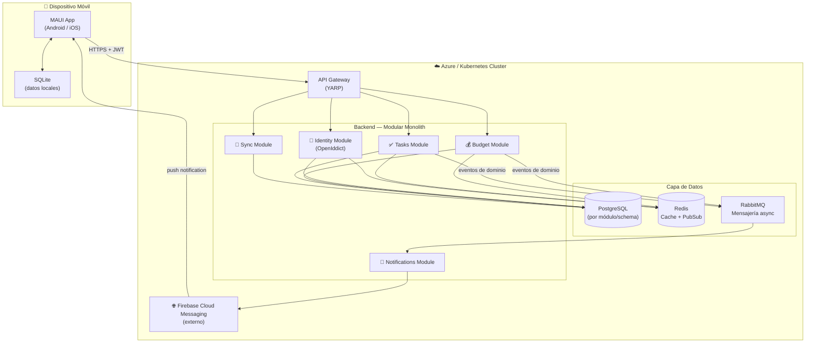
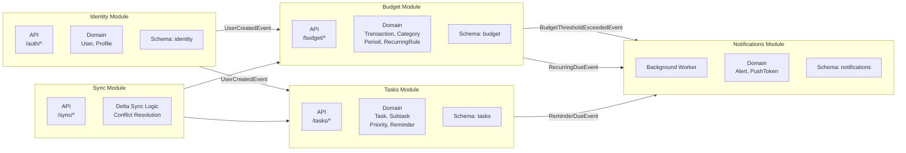
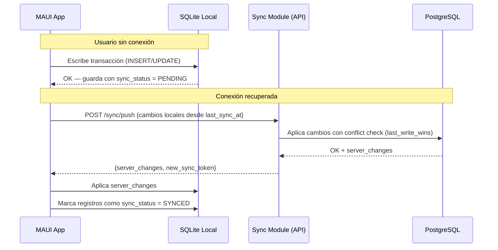
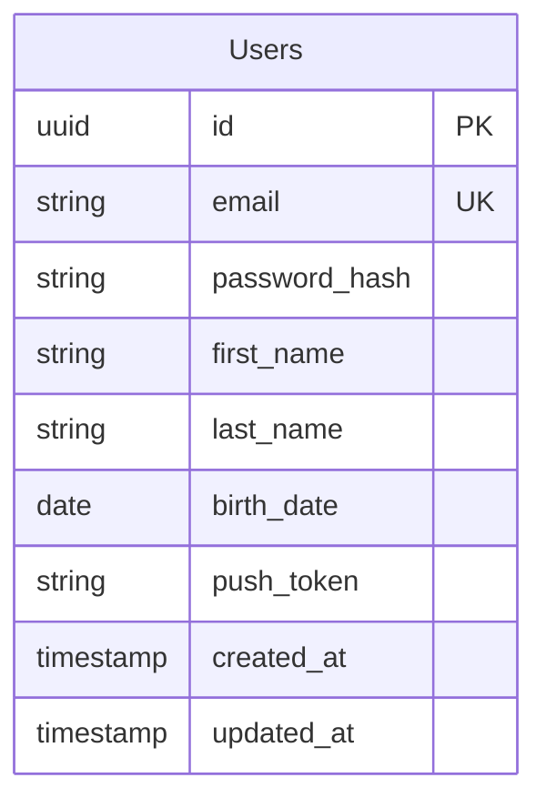
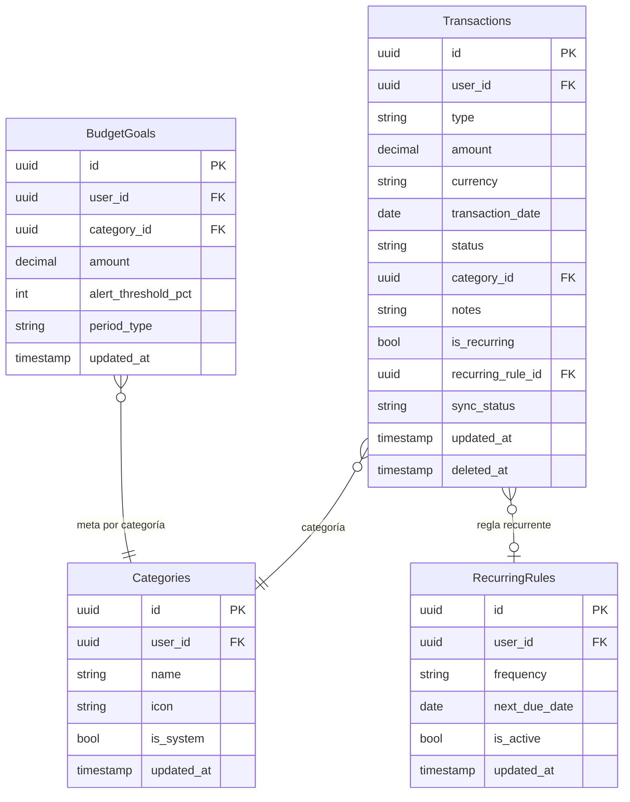
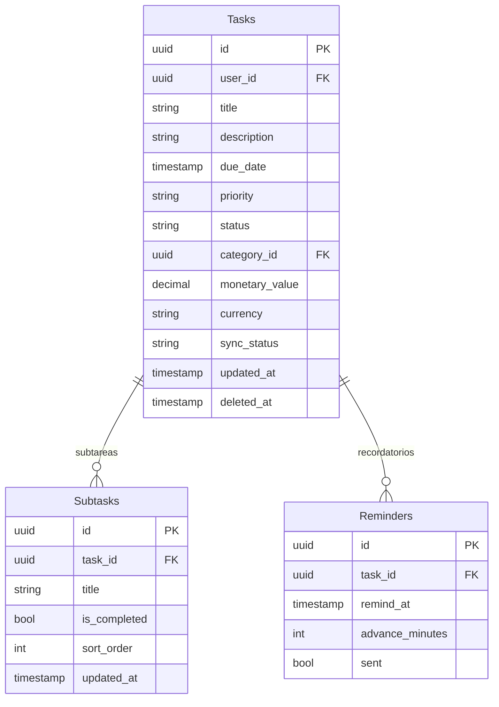
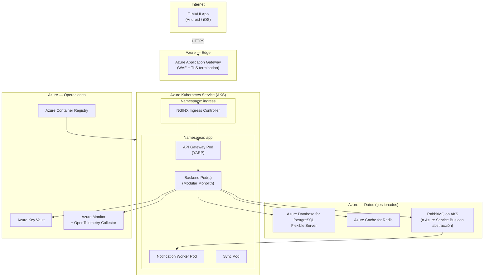
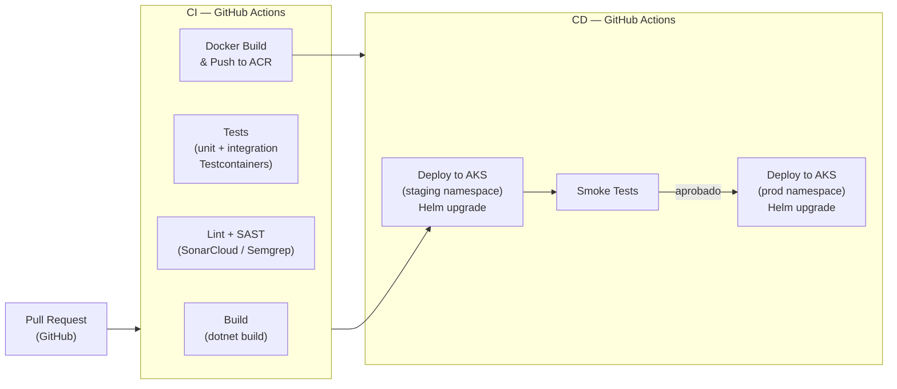

# Requerimiento de Producto — App de Gestión de Presupuesto y Tareas

> **Estado:** Definición funcional completa — lista para diseño UX e inicio técnico
> **Última actualización:** 2026-07-30

---

## 1. Idea Central

Aplicación móvil multiplataforma para personas que quieren tener control sobre sus **finanzas personales** y su **productividad diaria** desde un solo lugar, sin necesidad de usar múltiples aplicaciones separadas.

La app nace de una necesidad real: no existe una herramienta que combine de forma simple, intuitiva y efectiva la gestión de presupuesto personal con la gestión de tareas y tiempo. El usuario de a pie debe poder llevar sus finanzas y su agenda al día, sin curvas de aprendizaje, sin fricciones y sin perder tiempo en el registro.

La lógica de negocio residirá en una API independiente y modular, lo que garantiza escalabilidad hacia más usuarios, más plataformas y más funcionalidades en el futuro.

---

## 2. Usuarios Objetivo

| Horizonte | Perfil | Descripción |
|---|---|---|
| **Inicial (MVP)** | Persona individual | Usuario adulto que quiere ordenar sus finanzas personales y su lista de tareas desde el celular, sin conocimientos contables ni técnicos. |
| **Corto plazo** | Grupo familiar | La misma persona comparte la app con su familia para que cada miembro lleve sus propios datos con su cuenta. |
| **Largo plazo** | Usuarios masivos | La plataforma debe soportar miles de usuarios simultáneos sin rediseñar la arquitectura. |

**Perfil del usuario típico:** persona de a pie, no técnica, que paga arriendo, tiene suscripciones, recibe sueldo, hace compras del mercado y quiere saber si llega o no llega a fin de mes — y además tiene pendientes del día a día que no quiere olvidar.

---

## 3. Propuesta de Valor

- **Claridad financiera de un vistazo:** saber al abrir la app cuánto entró, cuánto salió y cuánto queda, sin hacer cuentas.
- **Control proactivo:** la app avisa antes de que el presupuesto se desborde, no después.
- **Tareas sin fricción:** registrar una tarea debe tomar segundos, no minutos. La app optimiza el tiempo, no lo consume.
- **Todo en un solo lugar:** finanzas y agenda, sincronizados, accesibles desde cualquier dispositivo.
- **Privacidad garantizada:** los datos financieros y personales están protegidos por autenticación propia de cada usuario.

---

## 4. Requerimientos No Funcionales Clave

Estos principios son tan importantes como las funcionalidades. Toda decisión de diseño y desarrollo debe evaluarse contra ellos.

| # | Principio | Descripción |
|---|---|---|
| RNF-01 | **Fácil** | Cualquier persona sin conocimientos técnicos o contables debe poder usar la app sin necesidad de un manual. Si necesita explicación, el diseño falló. |
| RNF-02 | **Intuitiva** | El usuario debe saber qué hacer en cada pantalla sin leer instrucciones. La navegación debe ser predecible y consistente. |
| RNF-03 | **Eficaz** | Registrar un gasto, un ingreso o una tarea no debe tomar más de 3 toques / segundos. La app debe dar valor real, no ser una carga. |
| RNF-04 | **Offline-first** | La app funciona sin conexión a internet. Cuando se recupere la red, sincroniza automáticamente con el servidor. |
| RNF-05 | **Multiplataforma** | Android e iOS desde el primer lanzamiento, con paridad funcional completa. |
| RNF-06 | **Escalable** | La arquitectura soporta desde 1 usuario hasta miles sin refactorización mayor. |
| RNF-07 | **Segura** | Los datos financieros y personales de cada usuario son privados y accesibles solo tras autenticación. |
| RNF-08 | **Modular** | Cada módulo (presupuesto, tareas, y futuros) es independiente. Se puede desplegar, actualizar o deshabilitar sin afectar los demás. |

---

## 5. Autenticación y Cuenta de Usuario

- El usuario debe **registrarse con email y contraseña** para usar la app.
- Cada usuario tiene su propio espacio de datos: nadie más puede ver sus finanzas ni sus tareas.
- La sesión persiste en el dispositivo (no debe loguearse cada vez).
- Para un alcance futuro: social login (Google, Apple ID).
- Los datos están vinculados a la cuenta, no al dispositivo: si el usuario cambia de teléfono, sus datos están disponibles al iniciar sesión.

---

## 6. Módulos del Producto

### 6.1 Dashboard — Pantalla de Inicio

Es la primera pantalla que ve el usuario al abrir la app. Debe transmitir el estado financiero y de tareas de forma inmediata, sin necesidad de navegar.

**Contenido del dashboard:**
- **Período activo** visible (ej. "Julio 2026") con opción de cambiar período.
- **Tarjeta de Ingresos:** total de ingresos del período.
- **Tarjeta de Gastos:** total de gastos del período.
- **Balance neto:** ingreso − gasto, con indicador visual (verde si positivo, rojo si negativo).
- **Barra o indicador de presupuesto:** qué porcentaje del presupuesto proyectado se ha consumido por categoría (resumen).
- **Acceso rápido a Presupuesto:** botón / tarjeta para ir al módulo de transacciones.
- **Acceso rápido a Tareas:** botón / tarjeta para ir al módulo de tareas, con contador de tareas pendientes para hoy.
- **Alertas activas:** notificaciones o banners de presupuestos por exceder o transacciones recurrentes pendientes de confirmar.

---

### 6.2 Módulo de Presupuesto *(Alcance 1 — prioritario)*

#### 6.2.1 Transacciones

Cada movimiento financiero (ingreso o gasto) es una **transacción**. El usuario registra, consulta, modifica y elimina transacciones.

**Datos de una transacción:**

| Campo | Tipo | Obligatorio | Notas |
|---|---|---|---|
| Tipo | Selección | ✅ | Ingreso / Gasto |
| Valor / Monto | Numérico | ✅ | Siempre positivo; el tipo define si suma o resta |
| Fecha | Fecha | ✅ | Por defecto: hoy |
| Categoría | Selección | ✅ | Ver sección de categorías |
| Estado | Selección | ✅ | Pagado / Pendiente |
| Moneda | Selección | ✅ | Por defecto: COP. El usuario puede seleccionar otra |
| Descripción / Nota | Texto libre | ❌ | Opcional |
| Es recurrente | Booleano | ❌ | Ver sección de recurrentes |
| Frecuencia (si recurrente) | Selección | ❌ | Mensual, quincenal, semanal, anual |

**Operaciones sobre transacciones:**
- Registrar nueva transacción.
- Editar transacción existente.
- Eliminar transacción (con confirmación explícita del usuario).
- Listar transacciones con filtros por: período, tipo, categoría, estado, moneda.

#### 6.2.2 Categorías

Las categorías clasifican cada transacción para entender en qué se gasta o de dónde viene el dinero.

**Categorías del sistema (predefinidas por la app):**
- No se pueden eliminar ni modificar.
- Siempre disponibles para todos los usuarios.
- Ejemplos sugeridos: Alimentación, Transporte, Vivienda, Salud, Educación, Entretenimiento, Sueldo, Freelance, Otros.

**Categorías personalizadas (creadas por el usuario):**
- El usuario puede crear sus propias categorías.
- Puede editarlas y eliminarlas libremente.
- Se identifican visualmente como "personalizadas".

#### 6.2.3 Períodos de Presupuesto

El usuario define el período sobre el cual quiere visualizar y controlar su presupuesto.

- **Opciones de período:** mensual, quincenal, semanal, anual, o fechas personalizadas (desde/hasta).
- El dashboard siempre muestra el período activo.
- El usuario puede navegar entre períodos para ver el histórico.

#### 6.2.4 Presupuesto Proyectado y Alertas

El usuario puede definir cuánto quiere gastar por categoría en un período.

- Se configura un monto máximo por categoría (presupuesto objetivo).
- La app muestra el porcentaje consumido vs. el objetivo en cada categoría.
- **Alertas de presupuesto:** cuando el gasto de una categoría supera el umbral configurado (ej. 80% o 100%), la app envía una notificación push al usuario.
- El usuario define el umbral de alerta (ej. avisar al 75%, al 90%, al 100%).

#### 6.2.5 Transacciones Recurrentes

Gastos o ingresos que se repiten con una frecuencia fija (arriendo, sueldo, suscripciones, cuotas de crédito, etc.).

- Al crear una transacción, el usuario puede marcarla como recurrente y definir su frecuencia.
- **La app NO registra la transacción automáticamente.** En cambio, envía una notificación al usuario cuando llega la fecha del próximo ciclo, para que confirme el registro (con opción de ajustar el valor o la fecha si hubo cambios).
- El usuario puede ver la lista de sus recurrentes configuradas y editarlas o desactivarlas.

#### 6.2.6 Monedas

- **Moneda por defecto:** COP (pesos colombianos).
- El usuario puede agregar otras monedas para registrar ingresos o gastos en divisas distintas (ej. USD por trabajo freelance).
- El dashboard y los totales se muestran en COP; las transacciones en otra moneda se muestran en su moneda original con referencia al valor en COP si se configura la tasa de cambio.
- La gestión de tasas de cambio se define en un alcance futuro; por ahora el usuario ingresa el valor manualmente en la moneda que prefiera.

#### 6.2.7 Reportes y Exportación

- **Gráficas en app:** visualización de gastos por categoría (torta o barras), evolución del balance por período (línea), comparativo ingreso vs. gasto.
- **Exportación a Excel:** el usuario puede exportar las transacciones de un período seleccionado a un archivo `.xlsx`.
- Exportación a PDF y otros formatos: alcance futuro.

---

### 6.3 Módulo de Tareas *(Alcance 2 — segundo ciclo)*

El principio rector de este módulo es la **velocidad de registro**: el usuario no debe perder más tiempo gestionando sus tareas del que le tomaría simplemente hacerlas. Registrar debe ser rápido, fluido y sin fricciones.

#### 6.3.1 Tareas

**Datos de una tarea:**

| Campo | Tipo | Obligatorio | Notas |
|---|---|---|---|
| Título | Texto corto | ✅ | Descripción breve y directa de la tarea |
| Descripción | Texto libre | ❌ | Detalle adicional opcional |
| Fecha de vencimiento | Fecha/hora | ❌ | Si se define, activa la opción de recordatorio |
| Prioridad | Selección | ❌ | Ver sección de prioridades |
| Estado | Selección | ✅ | Pendiente / En progreso / Completada |
| Categoría / Etiqueta | Selección | ❌ | Misma lógica que categorías de presupuesto |
| Subtareas | Lista | ❌ | Checklist interno de ítems |
| Valor monetario | Numérico | ❌ | Opcional: vincular la tarea a un monto (ej. "Pagar factura – $200.000") |
| Moneda (si tiene valor) | Selección | ❌ | Por defecto COP |
| Recordatorio | Fecha/hora | ❌ | Notificación push en la fecha/hora indicada |

**Operaciones sobre tareas:**
- Crear nueva tarea (flujo optimizado para rapidez: mínimo un título para guardar).
- Editar tarea existente.
- Marcar como completada (desde la lista, sin necesidad de abrir la tarea).
- Eliminar tarea (con confirmación).
- Listar tareas con filtros por: estado, prioridad, etiqueta, fecha, con/sin valor monetario.

#### 6.3.2 Prioridades / Banderas

**Prioridades del sistema (fijas, no eliminables):**
- Alta
- Media
- Baja

**Prioridades personalizadas:** el usuario puede crear, editar y eliminar sus propias banderas (con nombre y color).

#### 6.3.3 Subtareas

- Una tarea puede tener una lista de subtareas (checklist).
- Cada subtarea tiene: texto y estado (pendiente / completada).
- La tarea principal muestra el progreso (ej. "2 de 5 completadas").

#### 6.3.4 Recordatorios y Notificaciones

- El usuario puede configurar una o más fechas/horas de recordatorio por tarea.
- La app envía una notificación push en el momento configurado.
- Integración con calendario del dispositivo (Google Calendar, Apple Calendar): **alcance futuro**.

#### 6.3.5 Vista de Calendario

- Las tareas con fecha de vencimiento se pueden visualizar en una vista de calendario.
- Vistas disponibles: **día, semana, mes**.
- El usuario puede crear una tarea directamente desde el calendario tocando una fecha.

#### 6.3.6 Relación Tareas — Presupuesto

- El campo de valor monetario en una tarea es **opcional**.
- Casos de uso: "Pagar factura de internet – $89.000", "Comprar mercado – $350.000", "Cobrar proyecto freelance – $2.000.000".
- Las tareas con valor monetario no afectan automáticamente el presupuesto; el usuario decide si registrar la transacción asociada por separado.
- Para un alcance futuro: opción de convertir una tarea con valor en una transacción de presupuesto con un solo toque.

---

## 7. Flujos de Usuario Principales

```
[App]
  ├── [Login / Registro]
  │
  └── [Dashboard]
        ├── Ver balance del período activo
        ├── Ver alertas de presupuesto y recurrentes pendientes
        ├── Acceso rápido → [Módulo Presupuesto]
        │     ├── Ver transacciones (lista + filtros)
        │     ├── Agregar transacción  ← flujo rápido
        │     ├── Editar transacción
        │     ├── Eliminar transacción
        │     ├── Ver / gestionar categorías
        │     ├── Configurar presupuesto proyectado por categoría
        │     ├── Ver / gestionar recurrentes
        │     ├── Ver gráficas del período
        │     └── Exportar a Excel
        │
        └── Acceso rápido → [Módulo Tareas]
              ├── Ver tareas (lista + filtros)
              ├── Vista de calendario (día / semana / mes)
              ├── Agregar tarea  ← flujo ultra-rápido (solo título requerido)
              ├── Editar tarea (detalle, subtareas, recordatorio, valor)
              ├── Completar tarea desde la lista
              └── Eliminar tarea
```

---

## 8. Comportamiento Offline

- La app es **offline-first**: todas las operaciones de lectura y escritura funcionan sin conexión.
- Los datos se almacenan localmente en el dispositivo.
- Cuando hay conexión disponible, la app sincroniza automáticamente los cambios con el servidor en segundo plano.
- En caso de conflicto (ej. modificación del mismo dato en dos dispositivos), se aplica la estrategia "último cambio gana" (definición técnica pendiente).

---

## 9. Alcances Futuros (Fuera de Scope Inicial)

Los siguientes ítems fueron identificados pero quedan **explícitamente fuera del alcance del MVP**:

- Modo oscuro / temas de color.
- Social login (Google, Apple ID).
- Integración con calendario del dispositivo (Google Calendar, Apple Calendar).
- Exportación a PDF.
- Conversión automática de monedas con tasa de cambio en tiempo real.
- Convertir tarea con valor en transacción de presupuesto con un toque.
- Uso compartido / colaborativo entre usuarios (familiar o equipo).
- Distribución pública en Play Store / App Store.

---

## 10. Próximos Pasos

- [x] Validar documento con el product owner.
- [x] Crear wireframes del dashboard, presupuesto y tareas.
- [x] Definición técnica: arquitectura, stack, estructura de API modular.
- [x] Scaffolding del repositorio (estructura de carpetas y proyectos .NET).
- [x] Definir historias de usuario con criterios de aceptación — ambos alcances.
- [x] Organizar historias en sprints con estimación.
- [ ] Implementar Sprint 1: Autenticación + Offline-first.
- [ ] Implementar Sprint 2: Dashboard + CRUD de transacciones.

---

## 12. Arquitectura Técnica

### 12.1 Visión General

El sistema se compone de tres capas principales: el cliente móvil (MAUI), una capa de entrada (API Gateway) y el backend modular. La arquitectura adopta el patrón **Modular Monolith** como punto de partida, con límites de módulo tan claros que cada uno puede extraerse como microservicio independiente en el futuro sin cambiar contratos ni interfaces públicas.

**Principios de diseño técnico:**

| Principio | Aplicación |
|---|---|
| **Cloud-native portable** | Contenedores Docker + Kubernetes. Sin SDKs propietarios de Azure en la lógica de negocio. Portable a cualquier nube o on-premise. |
| **Modular** | Cada módulo de negocio es un proyecto independiente con su propio dominio, datos y contratos. No hay dependencias cruzadas directas. |
| **Offline-first** | SQLite en el dispositivo como fuente de verdad local. Sincronización delta en background cuando hay red. |
| **Open source first** | PostgreSQL, Redis, RabbitMQ, OpenTelemetry. Sin licencias propietarias en componentes críticos. |
| **Escalabilidad horizontal** | Stateless API, caché distribuida, mensajería asíncrona. Escala agregando instancias, no reescribiendo. |

---

### 12.2 Stack Tecnológico

#### Frontend

| Capa | Tecnología | Justificación |
|---|---|---|
| UI multiplataforma | **.NET MAUI 9** | Android + iOS desde una sola base de código en C# |
| Patrón de presentación | **MVVM + CommunityToolkit.Mvvm** | Separación limpia de UI y lógica de vista |
| Navegación | **Shell Navigation** | Navegación declarativa, soporte deep links |
| Base de datos local | **SQLite + EF Core** | Persistencia offline-first en el dispositivo |
| Sincronización | **Delta sync con timestamps** | Solo sincroniza registros cambiados desde última sync |
| HTTP Client | **Refit + HttpClientFactory** | Contratos de API tipados, retry policies |
| Inyección de dependencias | **Microsoft.Extensions.DI** | Nativo de .NET, sin terceros |

#### Backend

| Capa | Tecnología | Justificación |
|---|---|---|
| Framework | **ASP.NET Core 9** | Alto rendimiento, nativo .NET, LTS |
| API Gateway | **YARP** (Yet Another Reverse Proxy) | Open source de Microsoft, enrutamiento y rate limiting |
| Autenticación | **OpenIddict** | OAuth2 / OIDC open source, sin servidor externo de pago |
| ORM | **EF Core 9** | Code-first, migraciones, soporte PostgreSQL |
| Base de datos | **PostgreSQL 16** | Open source, ACID, JSON nativo, portable |
| Caché | **Redis 7** | Caché distribuida, rate limiting, pub/sub ligero |
| Mensajería asíncrona | **MassTransit + RabbitMQ** | Abstracción de bus; se puede cambiar el broker sin tocar el código |
| Notificaciones push | **Firebase Cloud Messaging (FCM)** | Android + iOS, gratuito, sin vendor lock-in de Azure |
| Observabilidad | **OpenTelemetry + Seq** | Trazas, métricas y logs; portable a cualquier backend (Jaeger, Grafana, etc.) |
| Pruebas | **xUnit + Testcontainers** | Tests de integración con contenedores reales |

#### Infraestructura y DevOps

| Capa | Tecnología | Justificación |
|---|---|---|
| Contenedores | **Docker + Docker Compose** | Dev local idéntico a producción |
| Orquestación | **Kubernetes (AKS)** | Portable a cualquier K8s; sin dependencia de Azure en manifiestos |
| IaC | **Bicep** (Azure) + **Helm** (K8s) | Bicep solo para provisionar recursos Azure; la app no lo conoce |
| CI/CD | **GitHub Actions** | Pipelines como código, gratuito para repos públicos |
| Registro de imágenes | **Azure Container Registry** | Puede reemplazarse por Docker Hub o cualquier registry OCI |

---

### 12.3 Diagrama de Arquitectura — Vista de Contenedores



---

### 12.4 Módulos del Backend

Cada módulo es un proyecto .NET independiente. La comunicación intra-módulo es **en proceso** (interfaces). La comunicación inter-módulo es **por eventos** a través del bus de mensajes (MassTransit/RabbitMQ), nunca por referencia directa entre módulos.



#### Estructura de módulo (patrón vertical slice)

```
src/
├── Modules/
│   ├── Identity/
│   │   ├── Identity.Api/          ← controllers, endpoints
│   │   ├── Identity.Application/  ← CQRS commands/queries (MediatR)
│   │   ├── Identity.Domain/       ← entidades, value objects, domain events
│   │   └── Identity.Infrastructure/ ← EF Core, repositorios, external services
│   │
│   ├── Budget/
│   │   ├── Budget.Api/
│   │   ├── Budget.Application/
│   │   ├── Budget.Domain/
│   │   └── Budget.Infrastructure/
│   │
│   ├── Tasks/
│   │   ├── Tasks.Api/
│   │   ├── Tasks.Application/
│   │   ├── Tasks.Domain/
│   │   └── Tasks.Infrastructure/
│   │
│   ├── Notifications/
│   └── Sync/
│
├── Gateway/                       ← YARP API Gateway
├── Shared/
│   ├── Shared.Kernel/             ← tipos base, abstracciones, contratos de eventos
│   └── Shared.Infrastructure/     ← logging, resiliencia, configuración común
│
└── Host/
    └── App.Host/                  ← punto de entrada, DI composition root
```

---

### 12.5 Estrategia Offline-First y Sincronización

La app funciona completamente sin conexión. La sincronización es **delta-based**: solo se transfieren los registros modificados desde la última sincronización exitosa.



**Reglas de conflicto:**
- Campo `updated_at` en cada registro (UTC).
- Si el servidor tiene un `updated_at` más reciente: el servidor gana.
- Si el cliente tiene un `updated_at` más reciente: el cliente gana.
- Eliminaciones: se usa **soft delete** con `deleted_at`; nunca se borra físicamente en sync.

---

### 12.6 Modelo de Datos por Módulo

#### Schema: `identity`



#### Schema: `budget`



#### Schema: `tasks`



---

### 12.7 Comunicación API — Convenciones

- **Protocolo:** HTTPS, REST JSON.
- **Autenticación:** Bearer JWT (access token 15 min + refresh token 30 días).
- **Versionado:** `/api/v1/` en todos los endpoints — cambios breaking generan `/api/v2/`.
- **Paginación:** cursor-based (`?after=<cursor>&limit=50`) para listas grandes.
- **Errores:** RFC 9457 Problem Details (`type`, `title`, `status`, `detail`).
- **Idempotencia:** operaciones de escritura aceptan header `Idempotency-Key` para reintentos seguros desde móvil.

---

### 12.8 Seguridad

| Área | Medida |
|---|---|
| Autenticación | OAuth2 / OIDC con OpenIddict. Tokens JWT firmados (RS256). |
| Autorización | Resource-based: cada usuario solo accede a sus propios datos (user_id en queries). |
| Transporte | TLS 1.2+ obligatorio. HSTS activado. |
| Contraseñas | Argon2id hashing (vía ASP.NET Core Identity). |
| Rate limiting | Redis token bucket por IP y por user_id en el Gateway. |
| Secrets | Variables de entorno / Azure Key Vault. Nunca en código ni en repositorio. |
| Datos en reposo | Cifrado de columnas sensibles (EF Core value converters) para datos financieros. |

---

### 12.9 Despliegue — Vista de Infraestructura Azure



> **Portabilidad:** Los pods no usan SDKs de Azure. `Azure Database for PostgreSQL` puede reemplazarse por PostgreSQL en cualquier nube. `Azure Cache for Redis` por Redis self-hosted. `Azure Service Bus` por RabbitMQ (ya abstraído con MassTransit). Migrar de nube implica cambiar variables de entorno y Helm values, no código.

---

### 12.10 Pipeline CI/CD



---

### 12.11 Estructura del Repositorio

```
/
├── .github/
│   └── workflows/              ← pipelines CI/CD
├── src/
│   ├── mobile/
│   │   └── PersonalHub.Mobile/ ← proyecto MAUI (Android + iOS)
│   ├── backend/
│   │   ├── Gateway/App.Gateway/ ← YARP Gateway
│   │   ├── Host/App.Host/       ← entry point, DI composition root
│   │   ├── Modules/
│   │   │   ├── Identity/        ← {Domain, Application, Api, Infrastructure}
│   │   │   ├── Budget/
│   │   │   ├── Tasks/
│   │   │   ├── Notifications/
│   │   │   └── Sync/
│   │   └── Shared/
│   │       ├── Shared.Kernel/
│   │       └── Shared.Infrastructure/
│   └── infra/
│       ├── docker/              ← docker-compose.yml (dev local)
│       ├── k8s/helm/            ← Helm charts (AKS)
│       └── bicep/               ← IaC Azure
├── tests/
│   ├── unit/
│   └── integration/
├── docs/
│   ├── REQUIREMENT.md
│   ├── WIREFRAMES.md
│   ├── USER_STORIES.md
│   └── adr/                    ← Architecture Decision Records
└── README.md
```

---

## 13. Idea Original (Referencia)

> *Texto original del requerimiento inicial, conservado como trazabilidad:*

Construir una aplicacion en MAUI que gestione tareas y presupuesto, que sirva para todos los dispositivos moviles. Esta aplicacion debe tener dos alcances principales y cada uno se va a desglozar y evolucionar de a poco, por lo que debe ser una aplicacion escalable. Asi mismo, la logica de negocio debe de estar en una API. El primer alcance: gestion de presupuesto. El segundo alcance: gestion de tareas.
